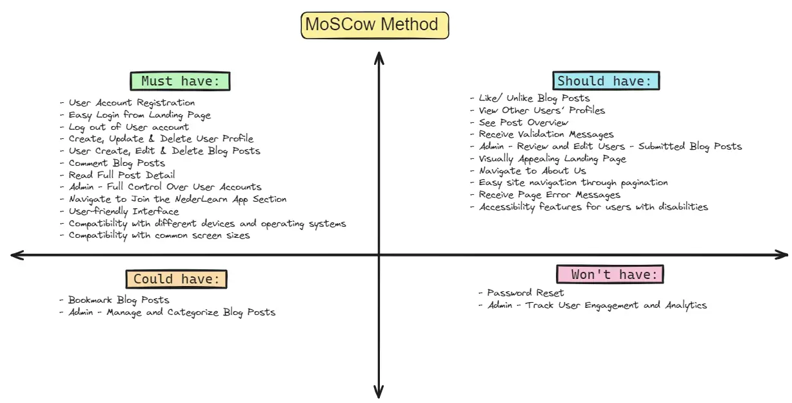
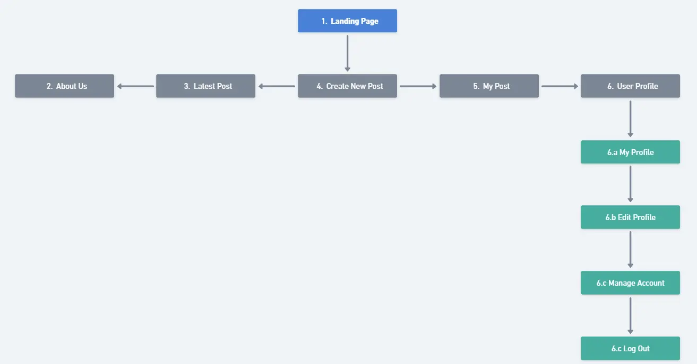
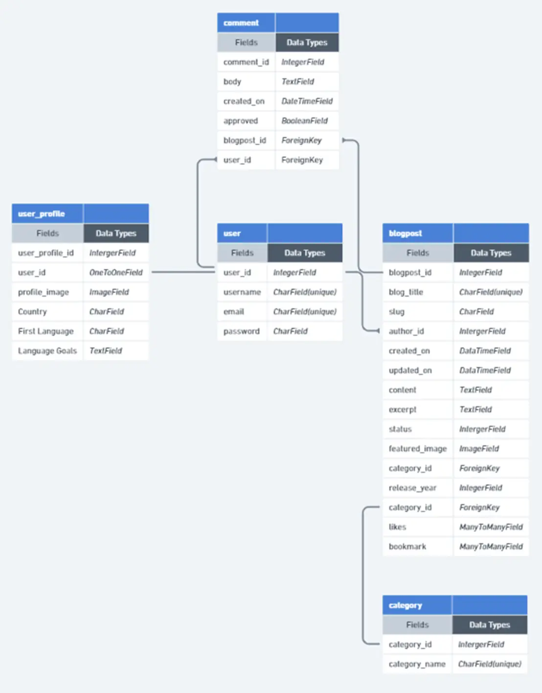
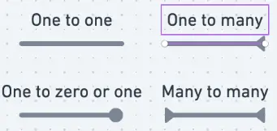

# NederLearn

### "Embrace the Adventure, Connect the World - NederLearn, Where Learning Dutch Becomes a Thrilling Journey"

NederLearn is an exciting companion in your journey to learn the Dutch language and understand its culture. Instead of the usual mundane and tedious language learning, NederLearn offers a thrilling exploration through films, books, articles, and podcasts about Dutch culture. It's more than just a language app, it's a community of Dutch language enthusiasts ready for a linguistic adventure. Whether you're an expat preparing for the Dutch Integration Exam or simply want to engage in light-hearted banter with Dutch colleagues, NederLearn is the perfect companion. Get ready to add a dash of excitement to your Dutch learning journey. Your adventure begins here.

[Live webpage](https://nederlearn-v2-668724e5173b.herokuapp.com/accounts/login/) 

## Table of Content

- [NederLearn](#nederlearn)
    - ["Embrace the Adventure, Connect the World - NederLearn, Where Learning Dutch Becomes a Thrilling Journey"](#embrace-the-adventure-connect-the-world---nederlearn-where-learning-dutch-becomes-a-thrilling-journey)
  - [Table of Content](#table-of-content)
  - [Project Overview](#project-overview)
    - [User Goals](#user-goals)
      - [**Product and Services**](#product-and-services)
      - [**Gain Creators**](#gain-creators)
      - [**Pain Relievers**](#pain-relievers)
      - [**Customer Jobs**](#customer-jobs)
      - [**Gains**](#gains)
    - [**Pains**](#pains)
    - [Site Owner Goals](#site-owner-goals)
  - [User Experience (UX) Design](#user-experience-ux-design)
    - [Target Audience](#target-audience)
    - [User Requirements and Expectations](#user-requirements-and-expectations)
    - [MoSCoW Method](#moscow-method)
    - [Epics \& User Stories](#epics--user-stories)
    - [Sitemap](#sitemap)
    - [Wireflow](#wireflow)
    - [Wireframe](#wireframe)
  - [User Interface (UI) Design](#user-interface-ui-design)
  - [Database Structure](#database-structure)
    - [EDR Symbols](#edr-symbols)
  - [Technologies Used](#technologies-used)
    - [**Languages**](#languages)
    - [**Frameworks**](#frameworks)
    - [**Database**](#database)
  - [**Media Management Platform**](#media-management-platform)
  - [**Tools:**](#tools)
  - [**Supporting Libraries and Packages**](#supporting-libraries-and-packages)
  - [Methodology](#methodology)
  - [Testing](#testing)
  - [Bugs](#bugs)
  - [Deployment](#deployment)
  - [Credits](#credits)
  - [Acknowledgments](#acknowledgments)

## Project Overview

NederLearn is a digital platform created specifically for English speakers who are interested in learning Dutch. The platform provides an assortment of media resources, including movies and podcasts, to help improve Dutch language proficiency. These resources span numerous topics and cater to different levels of Dutch language competence. The primary goals of NederLearn are to provide engaging language learning materials and foster a supportive community that promotes interaction among learners of the Dutch language.

### User Goals

We've chosen the Value Proposition Canvas (VPC) to visually demonstrate how our app's features align with our users' desires and necessities. The VPC consists of two parts: The Customer Profile, which examines the customer's identity and preferences, and The Value Map, which illustrates how a product can enhance the customer's experience.

> **The Value Proposition Canvas** >_Bland, David J.; Osterwalder, Alexander. Testing Business Ideas: A Field Guide for Rapid Experimentation (Strategyzer) (p. 22). Wiley. Kindle Edition._

Value Map

A Value Map illustrates the specific benefits of our app by highlighting its key features:

#### **Product and Services**

Here is a list of the services that the NederLearn app provides to its users:

- The platform is browser-based platform.
- The application's interface is designed to be simple and easy to navigate.
- The selected resource material is carefully curated.
- It offers a summary and an external link to the content.
- Users can choose from a variety of media formats: books, movies, music, podcasts, and series.
- Resources can be organized according to the **Common European Framework of Reference (CEFR)**:
  - A. Beginners Level
    - A1. Beginner
    - A2. Elementary
  - B. Intermediate Level
    - B1. Intermediate
    - B2. Upper Intermediate
  - C. Advanced Level
    - C1. Advanced
    - C2. Expert

#### **Gain Creators**

Here are the advantages users can enjoy when utilizing the NederLearn app:

- The app can be accessed on most devices with an internet connection.
- The NederLearn interface is designed to be user-friendly and easy to navigate, ensuring a positive user experience.
- The super user diligently reviews all materials. User comments serve as valuable feedback, further enhancing the quality of the recommendations. This process ensures users can access top-notch Dutch language resources without wasting time searching.
- Users can delve into a digital multimedia experience, with links to Dutch books, movies, music, podcasts, and series.
- Using the European language levels offers a clear structure that helps users identify their current proficiency in the language and outlines the steps needed to advance to the next level.

#### **Pain Relievers**

How the NederLearn app addresses user's challenges.

- The NederLearn app is accessible from any device with internet access, allowing users to learn at their own pace and convenience.
- The app features a user-friendly interface, reducing navigational difficulties and enhancing the learning process.
- Careful curation of resource material saves users time and effort in searching for quality content.
- Each content piece is accompanied by a summary and an external link, providing a quick overview and easy access.
- The app offers diverse media formats, catering to different learning preferences.
- Resources are organized according to the European Framework for Language Framework Levels, providing users a clear learning path and addressing the common challenge of progression in language learning.

Customer Profile

This provides a detailed and organized overview of a potential user segment interested in the NederLearn app.

#### **Customer Jobs**

Describe the tasks that the user want to do in their professional and personal life with the NederLearn app.

- Access learning material from any device with internet access
- Navigate a user-friendly interface
- Avoid wasting time searching for quality content
- Get a quick overview and easy access to each content piece
- Learn through diverse media formats
- Follow a clear learning path based on the European Framework for Language Framework Levels

#### **Gains**

Describe the goals users hope to achieve or the specific benefits they are seeking with the NederLearn app.

- Easy use of the app on different devices
- Simple navigation with a user-friendly interface
- Access to carefully checked, high-quality Dutch resources
- Fun with Dutch books, movies, music, podcasts, and series
- Clear learning path using European language levels

### **Pains**

Explain the possible bad results, risks, and problems that could happen from the tasks that users do with the NederLearn app.

- Some devices or browsers might not work well with the platform.
- The design might be hard to use for some people.
- There might not be enough different types of resources.
- The summaries might miss some key details.
- Users might not find their favorite media formats, like games or videos.
- The European Language Framework Levels might not match some users' real skill levels.
- There might not be enough content for advanced users to continue improving.

### Site Owner Goals

- Ensure that the Dutch resources suggested on the NederLearn app are of excellent quality and relevant for all users, regardless of their Dutch language level.
- To uphold an exceptional user experience by ensuring smooth navigation and a design that responds well on all devices.
- To ensure that the website provides a secure and friendly environment for all users to share their opinions about the recommended resources.

(<a href="#table-of-content">back to top</a>)

---

## User Experience (UX) Design

### Target Audience

- The target audience is English speakers interested in learning Dutch.
- This encompasses expatriates in the Netherlands, students learning Dutch, tourists planning a trip to the Netherlands, individuals preparing for the "Inburgering" exam, and anyone interested in Dutch culture and language.
- The app is suitable for various proficiency levels, from beginners to advanced learners.

### User Requirements and Expectations

- The NederLearn app features an aesthetically pleasing and intuitive interface, which promotes easy navigation and content discovery.
- A secure registration and login process, ensuring user data protection and privacy.
- Interactive features such as the ability to like, comment, and create posts that facilitate community engagement.
- Access to a wide variety of Dutch language resources and the ability for users to contribute their own insights and reviews.

### MoSCoW Method

The NederLearn application uses the MoSCoW method for brainstorming and prioritizing different features. This list is flexible and the final features of the NederLearn app may differ. The MoSCoW method categorizes tasks into four distinct groups for better organization and prioritization.

### Epics & User Stories

The NederLearn app employs the MoSCoW method to categorize its functionalities into Epics, with each Epic containing associated user stories. These tasks are segmented into four distinct 'epics', each corresponding to a specific sprint or milestone. Click this \*link for a detailed overview of the project milestones.

Epic 1: User Authentication & Profile Management

This Epic deals with handling user accounts, including registering, signing in and out, and modifying user profiles.

- User Account Registration [(Must Have)](https://github.com/users/Blignaut24/projects/16/views/2?filterQuery=User+Regi&pane=issue&itemId=92339719&issue=Blignaut24%7CNederlearn_V3%7C5)
- Easy Login from Landing Page [(Must Have)](https://github.com/users/Blignaut24/projects/16/views/2?filterQuery=login&pane=issue&itemId=92339607&issue=Blignaut24%7CNederlearn_V3%7C4)
- Log out of User account [(Must Have)](https://github.com/users/Blignaut24/projects/16/views/2?filterQuery=log+out&pane=issue&itemId=92339484&issue=Blignaut24%7CNederlearn_V3%7C3)
- Create, Update & Delete User Profile [(Must Have)](https://github.com/users/Blignaut24/projects/16/views/2?filterQuery=USER+STORY%3A+Create%2C+Update+%26+Delete+User+Profile)
- Password Reset [(Won't Have)](https://github.com/users/Blignaut24/projects/16/views/2?filterQuery=Password+)

Epic 2: Blog Interaction & Content Management

This Epic focuses on main blog features like making, reading, changing, and removing posts, and engaging with posts by commenting and liking.

- User Create, Edit & Delete Blog Posts [(Must Have)](https://github.com/users/Blignaut24/projects/16/views/2?filterQuery=User+Create%2C+&pane=issue&itemId=92342118&issue=Blignaut24%7CNederlearn_V3%7C13)
- Comment Blog Posts [(Must Have)](https://github.com/users/Blignaut24/projects/16/views/2?filterQuery=Comment+Blog+Posts)
- Like/ Unlike Blog Posts [(Should Have)](https://github.com/users/Blignaut24/projects/16/views/2?filterQuery=Like%2F+Unlike+Blog+Posts)
- View Other Users' Profiles [(Should Have)](https://github.com/users/Blignaut24/projects/16/views/2?filterQuery=USER+STORY%3A+View+Others+)
- See Post Overview [(Should Have)](https://github.com/users/Blignaut24/projects/16/views/2?filterQuery=Post+Overview)
- Read Full Post Detail [(Must Have)](https://github.com/users/Blignaut24/projects/16/views/2?filterQuery=Read+Full+Post+Detail)
- Bookmark Blog Posts [(Could Have)](https://github.com/users/Blignaut24/projects/16/views/2?filterQuery=Bookmark+Blog+Posts)
- Receive Validating Messages [(Should Have)](https://github.com/users/Blignaut24/projects/16/views/2?filterQuery=Validating+Me)

Epic 3: Administration & Analytics

This section covers site management such as overseeing user accounts, regulating content, and monitoring user activity.

- Admin - Full Control Over User Accounts [(Must Have)](https://github.com/users/Blignaut24/projects/16/views/2?filterQuery=Full+Control)
- Admin - Review and Edit User-Submitted Blog Posts [(Must Have)](https://github.com/users/Blignaut24/projects/16/views/2?filterQuery=Review+and+edit&pane=issue&itemId=92342811&issue=Blignaut24%7CNederlearn_V3%7C16)
- Admin - Manage and Categorize Blog Posts [(Could Have)](https://github.com/users/Blignaut24/projects/16/views/2?filterQuery=Manage+and+)
- Admin - Track User Engagement and Analytics [(Won't Have)](https://github.com/users/Blignaut24/projects/16/views/2?filterQuery=Track)

Epic 4: User Experience & Accessibility

This epic concentrates on improving the site's overall user experience, including the look of the homepage, ease of navigation, and information accessibility.

- Visually Appealing Landing Page [(Should Have)](https://github.com/users/Blignaut24/projects/16/views/2?filterQuery=Visually+)
- Navigate to About Us [(Should Have)](https://github.com/users/Blignaut24/projects/16/views/2?filterQuery=About+) 
- Compatibility with different devices and operating systems [(Must Have)](https://github.com/users/Blignaut24/projects/16/views/2?filterQuery=different+devices)
- Navigate to Join the Club Section [(Must Have)](https://github.com/users/Blignaut24/projects/16/views/2?filterQuery=Club)
- Navigate through a well designed website [(Must Have)](https://github.com/users/Blignaut24/projects/16/views/2?filterQuery=website)
- Site pagination for easy navigation [(Should Have)](https://github.com/users/Blignaut24/projects/16/views/2?filterQuery=Site+pagination)
- Receive Page Error Messages [(Won't Have)](https://github.com/users/Blignaut24/projects/16/views/2?filterQuery=Receive+Page) 

### Sitemap

### Wireflow

### Wireframe

(<a href="#table-of-content">back to top</a>)

---

## User Interface (UI) Design

(<a href="#table-of-content">back to top</a>)

---

## Database Structure

During the planning phase of the NederLearn project, I utilized [**Whimsical**](https://whimsical.com) to create an **Entity Relationship Diagram (ERD)** for visualizing the database structure schema.

### EDR Symbols

(<a href="#table-of-content">back to top</a>)

---

## Technologies Used

### **Languages**

- HTML
- CSS
- Python
- JavaScript

### **Frameworks**

- **Django:** Is a high-level Python web framework that promotes rapid development and pragmatic, clean design. It adheres to the "don't repeat yourself" (DRY) principle and is built on the model-view-template architectural pattern. It was used to build the NederLearn app web app.
- **Crispy Form:** Is a Django application that helps you manage and format your Django form output. It allows you to control form rendering in your templates while keeping boilerplate to a minimum. It supports different form styles and integrates seamlessly with Bootstrap 4 and up.
- **Boostrap v5.0:** Bootstrap is a free tool that helps you build websites that look good on both desktop and mobile. It has templates for different parts of a website, which can save developers time and effort.

### **Database**

- **ElephantSQL:** Is a service that takes care of all the complex stuff related to managing a PostgreSQL database.

## **Media Management Platform**

- **Cloudinary:** This is a cloud-based platform that facilitates the storage, management, and delivery of media for the NederLearn app. It specifically handles image management for the project.

## **Tools:**

- **Font Awesome:** Is a collection of free, changeable vector icons you can use on a website.
- **Git:** A platform that holds and manages Git repositories, making it easy to work together and keep track of different versions of the project's code.
- **GitHub:** Is a web-based platform that provides hosting for software development and version control using Git.
- **Gitpod:** Is an online IDE platform that lets you easily create software straight from your web browser.
- **Google Fonts:** A library of free, open-source fonts, used to enhance typography on the website.
- **Heroku:** A cloud application platform used for deploying and hosting the NederLearn app.
- **Notion AI:** Is an artificial intelligence tool designed to assist with note-taking, data management, and organization within the Notion platform. It aids in planning and writing the NederLearn app README document.
- **Whimsical:** Is a collaborative visual workspace used for brainstorming, designing, and coordinating team efforts. It has been utilized to design visual diagrams, create flowcharts, wireframes, and sticky notes for the NederLearn app, enhancing the app's conceptualization and planning process.

## **Supporting Libraries and Packages**

- `asgiref==3.7.2`: This package allows your Python web application to handle multiple requests at the same time.
- `cloudinary==1.37.0`: This helps your application to manage images and videos in the cloud.
- `dj-database-url==0.5.0`: This simplifies the process of connecting your Django application to a database.
- `dj3-cloudinary-storage==0.0.6`: This is used to store and manage your Django application's files in the cloud using Cloudinary.
- `Django==4.2.1`: Django is a high-level Python web framework that helps you build web applications quickly.
- `gunicorn==21.2.0`: This is a server that runs your web application.
- `psycopg2==2.9.9`: This package allows your Django application to interact with PostgreSQL database.
- `pytz==2023.3.post1`: This helps you handle different time zones in your Python applications.
- `sqlparse==0.4.4`: This is a library that helps you parse SQL queries.
- `urllib3==1.26.15`: This package allows your application to send HTTP requests.

(<a href="#table-of-content">back to top</a>)

---

## Methodology

(<a href="#table-of-content">back to top</a>)

---

## Testing

(<a href="#table-of-content">back to top</a>)

---

## Bugs

(<a href="#table-of-content">back to top</a>)

---

## Deployment

(<a href="#table-of-content">back to top</a>)

---

## Credits

(<a href="#table-of-content">back to top</a>)

---

## Acknowledgments

(<a href="#table-of-content">back to top</a>)

---
